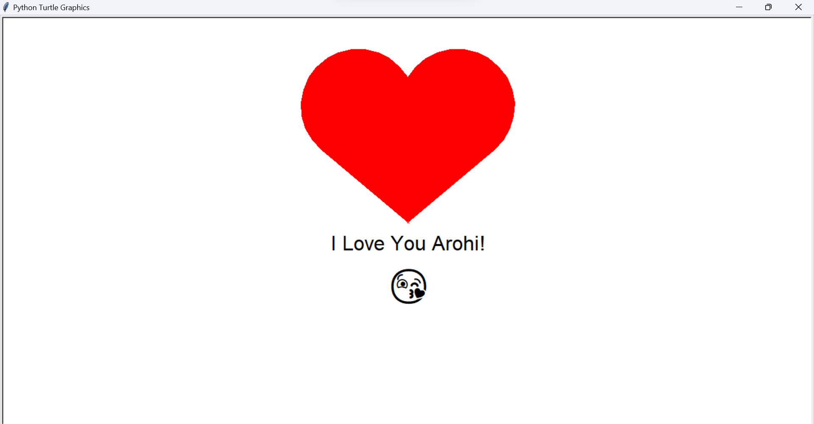

**# 💖 A Heartfelt Message with Python Turtle ❤️**

A simple and sweet Python script that uses the `turtle` library to draw a heart and display a lovely message.

---

## 🖼️ Final Output

After running the script, a window will appear and you will see a heart being drawn using Python Turtle graphics. Once the drawing is complete, a sweet message saying "I Love You Arohi! ❤️" will appear on the screen. 🎉



---

## ✨ Features

*   **Animated Drawing:** Watch as the turtle draws a perfect red heart.
*   **Custom Message:** Displays "I Love You Arohi!" with a cute emoji.
*   **Beginner-Friendly:** A great example of creative coding with Python's built-in `turtle` module.

---

## ⚙️ Technical Details

The script operates as follows:
1.  **Screen Setup:** Initializes a `turtle.Screen` object and sets the background color to white.
2.  **Heart Turtle:** A `turtle.Turtle` instance named `heart` is created to draw the heart. Its color is set to red and drawing speed is configured.
3.  **Drawing Logic:** The `draw_heart` function contains the sequence of `turtle` commands (`left`, `forward`, `circle`) to draw the heart shape. `begin_fill()` and `end_fill()` are used to color the shape red.
4.  **Text Turtle:** A second, separate `turtle.Turtle` instance is created for writing the text. This prevents drawing unwanted lines when moving to the text position.
5.  **Positioning and Writing:** The text turtle's pen is lifted using `penup()`. It is then moved to the desired coordinates with `goto()`. The `write()` method displays the message and emoji with specified alignment and font.
6.  **Cleanup:** Both turtles are hidden using `hideturtle()` for a clean final presentation.
7.  **Display:** `turtle.done()` keeps the graphics window open for viewing.

---

## 📂 Repository Structure

```
/arohi_propose_files/
└── index.py      # The main Python script to run the drawing
```

---

## 🚀 How to Run

### Prerequisites

*   Python 3.x installed on your system.

### Execution

1.  **No Installation Needed:** The `turtle` module comes built-in with Python.
2.  Open your terminal or command prompt, navigate to the project directory, and run:
    ```bash
    python index.py
    ```
3. A new window will pop up and draw the heart and message for you!

---

## 👤 Author

**Ritesh Raut**  
*Programmer Analyst, Cognizant*

❤️ Code from the Heart — Say It with Python Turtle! 💌🐢

---

### 🌐 Connect with me:
<p align="left">
<a href="https://github.com/Riteshraut0116" target="blank"></a>
<a href="https://linkedin.com/in/ritesh-raut-9aa4b71ba" target="blank"></a>
<a href="https://www.instagram.com/riteshraut1601/" target="blank"></a>
<a href="https://www.facebook.com/ritesh.raut.649321/" target="blank"></a>
</p>

---
